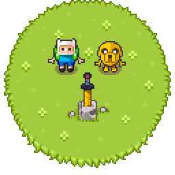

# Jake Zeledón — Personal Portfolio

Modern, interactive portfolio showcasing my work as a Fullstack Software Engineer with a strong focus on frontend systems and AI evaluation.

Designed to highlight real-world experience through clean UI, smooth interactions, and a strong emphasis on accessibility and performance.

<div align="center">
  
</div>


## 🚀 Tech Stack

- **Frontend**
  - HTML5
  - CSS3 (custom, no frameworks)
  - JavaScript (ES6+)

- **Libraries & Interaction**
  - GSAP (animations & scroll-based interactions)

- **Other Tools**
  - Git & GitHub

## ✨ Features

- **Light/Dark Mode**: Toggle between light and dark themes.
- **Multilingual Support**: English and Spanish language toggle.
- **Responsive Design**: Fully responsive design optimized for both desktop and mobile.
- **Interactive UI**: Engaging user interface with dynamic components, including an interactive experience section.

## 💻 Installation and Setup

1. Clone the repository:

   ```bash
   git clone https://github.com/JackZeled0n/portfolio.git
   ```

2. Navigate to the project directory:

   ```bash
   cd portfolio
   ```

3. Open `index.html` in your preferred browser to view the portfolio.

4. For local development, serve the files using a simple HTTP server:

   ```bash
   npx serve
   ```

## 🛠️ Future Improvements

- Add more interactive elements and animations.
- Implement a portfolio section to share my projects.
- Further optimize for performance and accessibility.

## 📬 Contact

Feel free to reach out to me via:
- **Email**: [jackiezeledon@gmail.com](mailto:jackiezeledon@gmail.com)
- **LinkedIn**: [Jake Zeledon](https://www.linkedin.com/in/jakezeledon/)

## 📄 License

This project is licensed under the Creative Commons Attribution-NonCommercial 4.0 International License. To view a copy of this license, visit [CC BY-NC 4.0 License](https://creativecommons.org/licenses/by-nc/4.0/).

Please note that the use of this software for commercial purposes is strictly prohibited.

